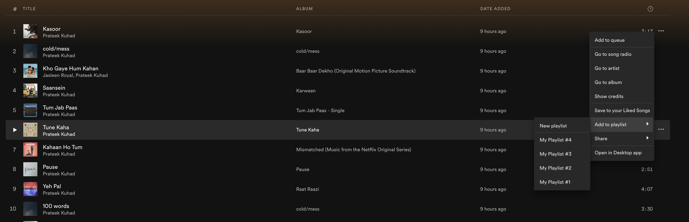
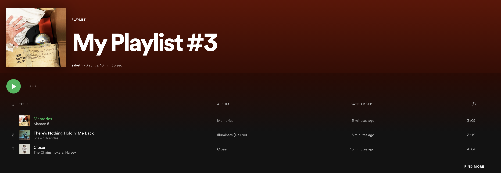
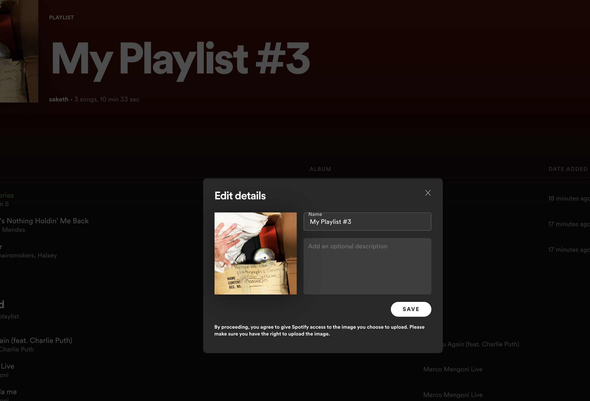
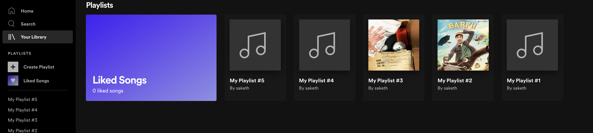

# Day 10

## Spotify: Playlists

- Create a playlist data in the `App` component which contains list of songs. User should be able to create multiple playlists
- Add an option for every song in the `Song` component which provides an option to add it to the selected playlist like below

    

- Provide an option the nav bar called **Create playlist** which creates a new playlist everytime when use click on it
- Create a component called Playlist which renders the list of songs you have added to the playlist same as the `Songs` component as shown below. Here you can reuse the same `Songs` component 

    

- When user clicks on playlist name, provide an option to the user to update the playlist with the help of Modal as shown in the picture

    

- Create a component called `Library` which renders all the playlists like shown below

    

**Note**: Use react router to render the components whereever it is necessary